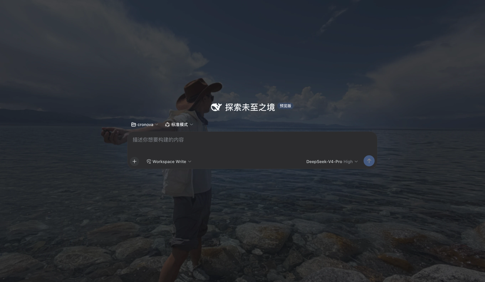
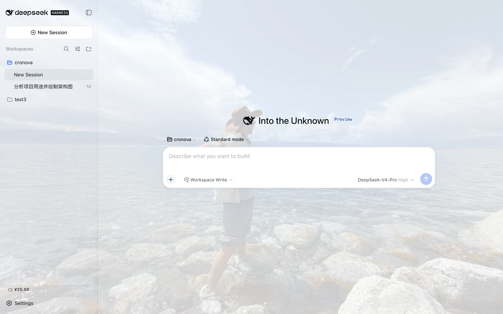
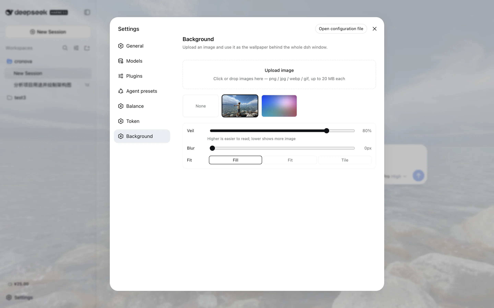

# @zoytown/dsh-avatar

English | [中文](README.zh.md)

Wallpaper theming plugin for [DeepSeek Harness](https://github.com/deepseek-ai/deepseek-harness) (dsh):
upload images from the Settings page, pick one, and the whole dsh web UI renders over it —
with an adjustable readability veil, background blur, and fill mode.



- **Upload in the UI** — click or drag & drop (png / jpg / webp / gif, 20 MB per image by default);
  files land in `~/.dsh/avatar/v1/` under content-addressed names
- **Gallery** — thumbnails of everything you uploaded; click to apply, hover to delete,
  pick **None** to go back to the plain theme
- **Readability controls** — a veil slider (the UI surfaces stay translucent over the image),
  a blur slider, and fill / fit / tile modes; changes preview live and persist automatically
- **Scheme-aware** — the veil re-tints itself from the active light/dark palette; one image serves both

## Screenshots





## Install

```bash
dsh plugin --profile web add @zoytown/dsh-avatar
```

Then open **Settings → Background** in the dsh web UI. Remove with
`dsh plugin --profile web remove @zoytown/dsh-avatar` — the UI reverts fully; uploaded images stay
in `~/.dsh/avatar/` until you delete that directory.

## Configuration

Row config (override by id `dsh-avatar` in your `cordis.patch.yml`; restate every field):

| Field | Default | Meaning |
|---|---|---|
| `maxImageBytes` | `20971520` | Per-image upload cap in bytes |
| `trustedHosts` | `[]` | Non-loopback authorities allowed to **fetch image bytes** (`host` or `host:port`). Uploads and preferences stay loopback-only regardless, because the harness pins its settings API to loopback. |
| `dshHome` | *(unset)* | Override the dsh home the wallpaper directory lives under |

User preferences (active wallpaper, veil opacity, blur, fill) live in the `avatar` section of
`~/.dsh/settings.yaml`.

## Scope and limitations

- **dsh web only.** The Electron form has no HTTP server, so the image route this plugin relies on
  does not exist there.
- **Remote (non-loopback) browsers are read-only.** The harness rejects settings reads/writes from
  non-loopback origins, so the Background page disables itself with a note, and the wallpaper is
  not applied there.
- **No data leaves your machine.** This plugin makes no external requests and reports nothing.
- Sticky headers and small chips become slightly translucent while a wallpaper is active — that is
  the veil working; raise the veil slider if anything is hard to read.

Every behavioral claim in this README was verified on 2026-08-18 against dsh
`@deepseek-ai/dsh-*@0.1.0-rc.6` with this plugin at 0.1.0.

## FAQ

### How do I set a custom background / wallpaper in DeepSeek Harness (dsh)?

Install this plugin, open **Settings → Background**, upload an image, and click its thumbnail —
the wallpaper applies immediately and persists. Installation is one command:
`dsh plugin --profile web add @zoytown/dsh-avatar`.

### Which image formats and sizes are supported?

png, jpg, webp, and gif, up to 20 MB per image by default. The cap is the `maxImageBytes` row
config; the format is detected from the file bytes, so a renamed non-image is rejected regardless
of its extension.

### I uploaded an image but the background did not change — why?

Most often the plugin is not actually active in your profile — run
`dsh --profile web --dump-config` and look for the `# == @zoytown/dsh-avatar` layer; if it is
missing, re-run the install command. Two by-design cases: a remote (non-loopback) browser is
read-only and never shows the wallpaper, and the Electron desktop app is not supported at all.

### Where are my images stored? Do they leave my machine?

They stay on your machine and nothing is uploaded anywhere: image bytes live in
`~/.dsh/avatar/v1/` under content-addressed names (`<sha256>.<ext>`), and preferences live in the
`avatar` section of `~/.dsh/settings.yaml`. The plugin makes no external requests.

### How do I go back to the default look?

Pick **None** in the gallery — it restores the plain theme background and keeps your uploads.
Removing the plugin (`dsh plugin --profile web remove @zoytown/dsh-avatar`) also reverts the UI
completely.

### The text is hard to read over my image — what should I do?

Raise the **Veil** slider (higher = more readable), or add some **Blur**. Busy photographs usually
read well from veil ≈ 80% upward, or with blur ≥ 8 px.

### Does it work in the Electron desktop app or over remote access?

No for Electron: that form has no HTTP server, so the image route this plugin relies on does not
exist there. Remote (non-loopback) browsers get a read-only Background page and no wallpaper,
because the harness pins its settings API to loopback.

## Development

```bash
pnpm install   # use pnpm — npm currently crashes on this dependency graph
pnpm run typecheck && pnpm run build
```

## License

MIT
