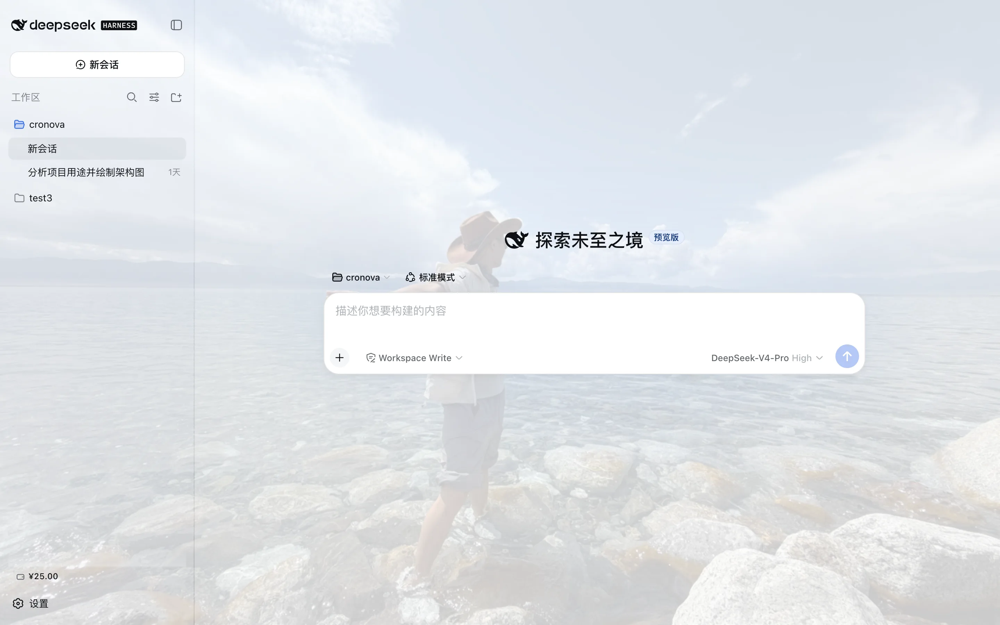
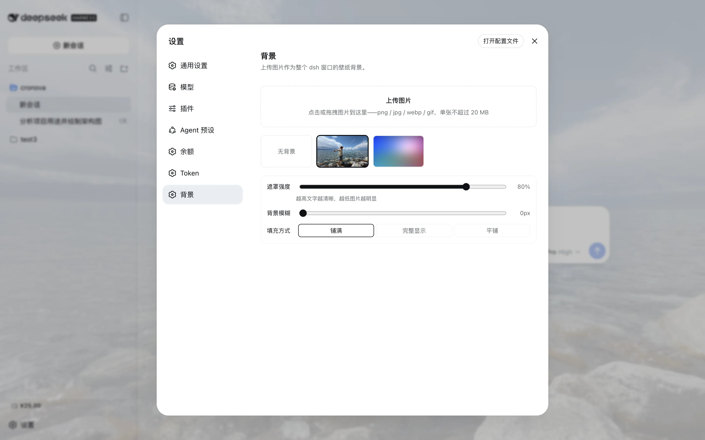

# @zoytown/dsh-avatar

[English](README.md) | 中文

[DeepSeek Harness](https://github.com/deepseek-ai/deepseek-harness)（dsh）的壁纸主题插件：
在设置页上传图片，选中后整个 dsh Web 界面以它为背景——遮罩强度、背景模糊、填充方式均可调。


- **界面内上传**——点击或拖拽（png / jpg / webp / gif，默认单张 20 MB 上限）；
  文件以内容寻址名落盘 `~/.dsh/avatar/v1/`
- **图库**——已上传图片的缩略图网格；点选即应用，悬停可删除，选「无背景」恢复纯色主题
- **可读性控制**——遮罩滑杆（界面表面在图片上保持半透明）、模糊滑杆、铺满/完整/平铺三种填充；
  调整即时预览并自动保存
- **明暗自适应**——遮罩颜色跟随当前 light/dark 配色自动取色；一张图同时服务两种外观

## 界面截图





## 安装

```bash
dsh plugin --profile web add @zoytown/dsh-avatar
```

然后在 dsh Web 界面打开 **设置 → 背景**。卸载用
`dsh plugin --profile web remove @zoytown/dsh-avatar`——界面完全还原；已上传的图片保留在
`~/.dsh/avatar/`，需要时手动删除该目录。

## 配置

row 配置（在你的 `cordis.patch.yml` 里按 id `dsh-avatar` 覆盖；必须整体重述所有字段）：

| 字段 | 默认值 | 含义 |
|---|---|---|
| `maxImageBytes` | `20971520` | 单张图片上传上限（字节） |
| `trustedHosts` | `[]` | 允许**读取图片字节**的非 loopback 来源（`host` 或 `host:port`）。上传与偏好读写始终仅限 loopback——harness 的 settings API 本身钉死 loopback。 |
| `dshHome` | *(未设)* | 覆盖壁纸目录所在的 dsh home |

用户偏好（当前壁纸、遮罩强度、模糊、填充）存于 `~/.dsh/settings.yaml` 的 `avatar` 段。

## 范围与限制

- **仅支持 dsh web。** Electron 形态没有 HTTP 服务器，本插件依赖的图片路由在那里不存在。
- **远程（非 loopback）浏览器为只读。** harness 拒绝非 loopback 来源的偏好读写，
  「背景」页会自行禁用并说明，壁纸也不会在远程侧生效。
- **数据不出本机。** 本插件不发起任何外部请求，不上报任何内容。
- 壁纸激活时 sticky 表头与小徽标会轻微半透明——这正是遮罩在工作；觉得难读就调高遮罩滑杆。

本 README 中的行为描述均于 2026-08-18 以 dsh（`@deepseek-ai/dsh-*@0.1.0-rc.6`）+ 本插件 0.1.0 实测验证。

## 常见问题（FAQ）

### dsh 怎么更换背景壁纸？

装上本插件，打开 **设置 → 背景**，上传图片后点选缩略图即可——壁纸立即生效并自动保存。
安装只需一条命令：`dsh plugin --profile web add @zoytown/dsh-avatar`。

### 支持哪些图片格式？最大多大？

png、jpg、webp、gif，默认单张不超过 20 MB。上限由 row 配置 `maxImageBytes` 控制；
格式按文件字节识别，改扩展名的非图片文件会被拒绝。

### 上传了图片但背景没变，怎么排查？

最常见的原因是插件没有真正装进 profile——运行 `dsh --profile web --dump-config`，
找 `# == @zoytown/dsh-avatar` 层；没有就重新执行安装命令。另有两种设计如此的情况：
远程（非 loopback）浏览器是只读的，不会显示壁纸；Electron 桌面版完全不支持。

### 图片存在哪里？会被上传到外网吗？

图片只存在你的本机，不会上传到任何地方：图片字节以内容寻址名（`<sha256>.<ext>`）存于
`~/.dsh/avatar/v1/`，偏好存于 `~/.dsh/settings.yaml` 的 `avatar` 段。本插件不发起任何外部请求。

### 怎么恢复默认外观？

在图库中点「**无背景**」——恢复纯色主题背景，已上传的图片保留。
卸载插件（`dsh plugin --profile web remove @zoytown/dsh-avatar`）同样会让界面完全还原。

### 壁纸上的文字看不清怎么办？

调高「**遮罩强度**」滑杆（越高越清晰），或加一些「**背景模糊**」。
内容繁杂的照片通常在遮罩 ≈ 80% 以上、或模糊 ≥ 8 px 时可读性良好。

### Electron 桌面版或远程访问能用吗？

Electron 不能用：该形态没有 HTTP 服务器，本插件依赖的图片路由在那里不存在。
远程（非 loopback）浏览器只会看到只读的「背景」页且不显示壁纸——harness 的
settings API 钉死 loopback。

## 开发

```bash
pnpm install   # 请用 pnpm——npm 当前在此依赖图上会崩溃
pnpm run typecheck && pnpm run build
```

## License

MIT
